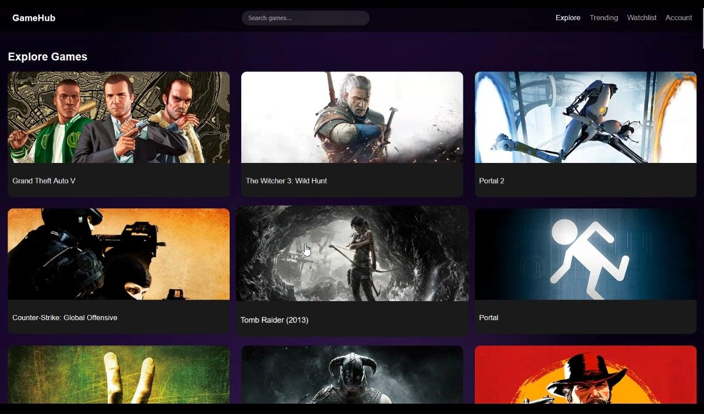
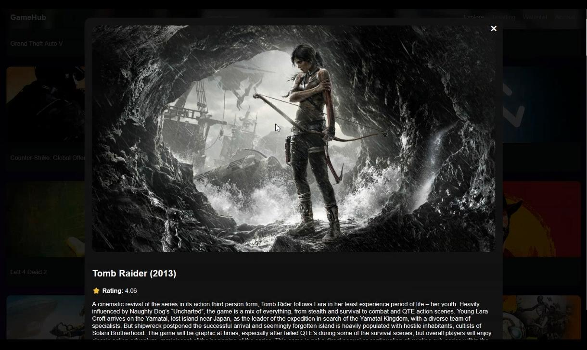
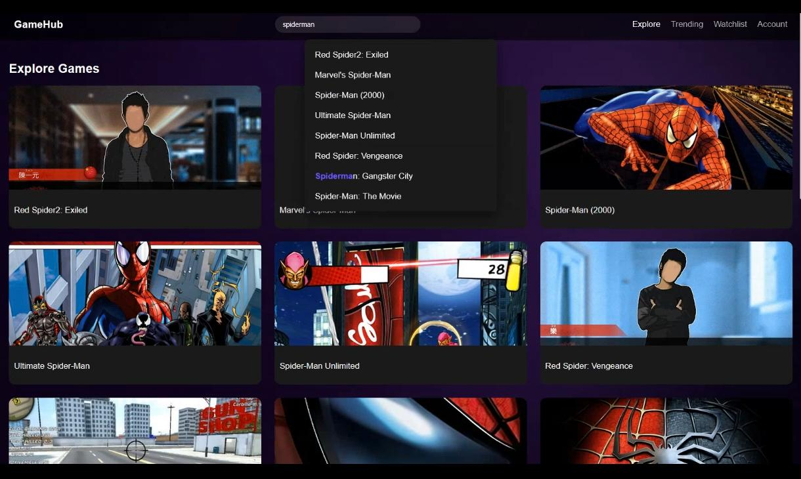
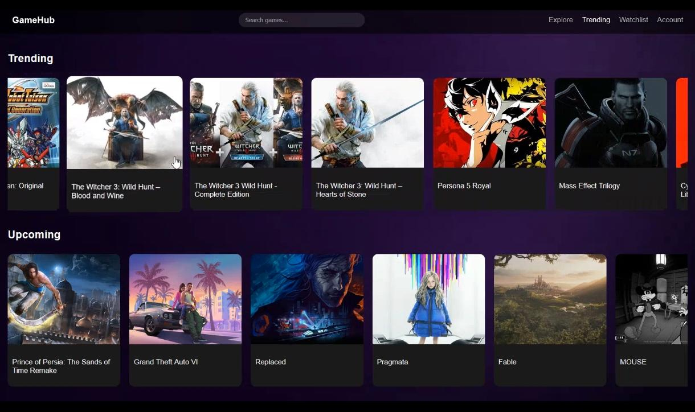
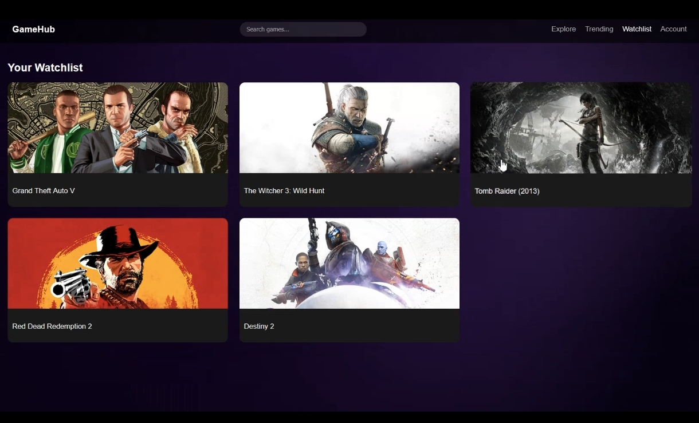
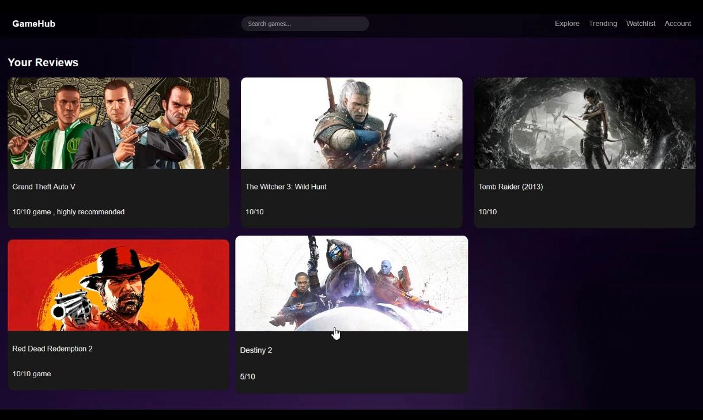

🎮 GameHub

🌟 Overview

    GameHub is a modern web-based game discovery platform that allows users to explore, search, and manage games using real-time data from the RAWG API.
    It features a clean UI, smooth navigation, and interactive animations to enhance user experience.

🚀 Features :-
    
    🔐 Login & Registration (LocalStorage-based)
    🔍 Real-time Game Search
    🎮 Explore Games
    🔥 Trending Games Section
    ⭐ Watchlist System
    📝 Reviews Section

🛠️ Tech Stack

    Frontend	HTML, CSS, JavaScript
    Backend	Node.js, Express.js
    API	RAWG Video Games Database
    Animations	GSAP

📂 Project Structure 

    GameHub/
    │
    ├── index.html
    ├── login.html
    ├── style.css
    ├── script.js
    ├── auth.js
    │
    ├── Background/
    │   └── bg.mp4
    │
    └── README.md

⚙️ Installation & Setup
   
    1️⃣ Clone Repository
       git clone https://github.com/your-username/gamehub.git
       cd gamehub
    2️⃣ Add API Key
       Open script.js and replace:
       const API_KEY = "a16085edbea84209b6b14f814ec052da";
    3️⃣ Run Project
       Open login.html in browser
                 OR
       Use Live Server (VS Code)

🔑 Authentication System
  
    Uses LocalStorage
    Stores:
      Username & Password
      Login Status

🌐 API Integration

    Game data is fetched using:
    https://api.rawg.io/api/games?key=YOUR_API_KEY

📸 Screenshots

    
    
    
    
    
    
    

⚠️ Limitations
 
    ❌ No database (LocalStorage only)
    🌐 Requires internet connection
    📉 API rate limits
    
🚧 Future Improvements
    
    🎬 Game trailers
    ☁️ Cloud database (MongoDB/Firebase)
    🤖 AI-based recommendations
    📱 Fully responsive design
    👤 User profiles & avatars

👨‍💻 Contributors

    Bonela Praveen Kumar
    Sanjeev Swain
    Soumya Ranjan Parida

📄 License

    This project is created for educational purposes only.

⭐ Support
    
    If you like this project:
    Give it a star ⭐ on GitHub
    Share with your friends 🎮
